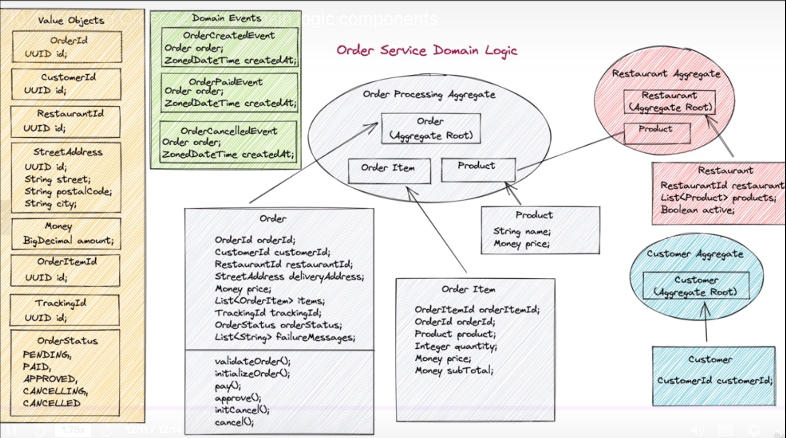

# Domain Logic Diagram



# Aggregates JSON samples

## Order Aggregate

```json
{
  "id": { "value": "000000000-0000000-00000000000-0000000000" },
  "customerId": "000000",
  "restaurantId": "000000",
  "deliveryAddress": "adress",
  "price": 1000,
  "items": [
    {
      "orderItemId": "00000",
      "orderId": "0000",
      "product": { "name": "product", "price": 1000 },
      "price": 1000,
      "subTotal": 10000
    }
  ],
  "trackingId": "0000",
  "orderStatus": "deliverd",
  "failureMessages": ["message one", "message two"]
}
```

## Restaurant Aggregate

```json
{
  "restaurant": "0000",
  "products": [
    {
      "name": "product",
      "price": 1000
    }
  ],
  "active": true
}
```

## Customer Aggregate

```json
{
  "customerId": "0000"
}
```
